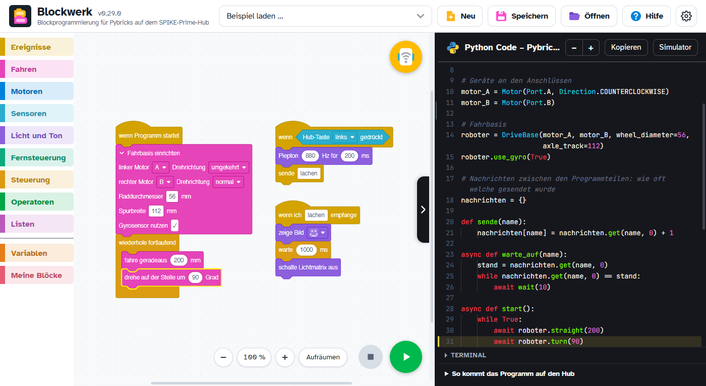
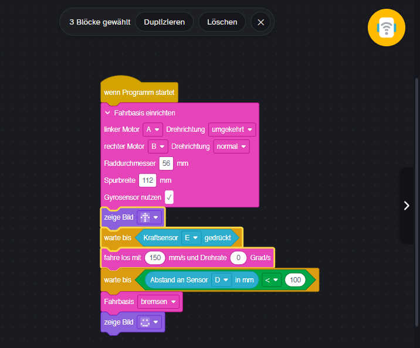
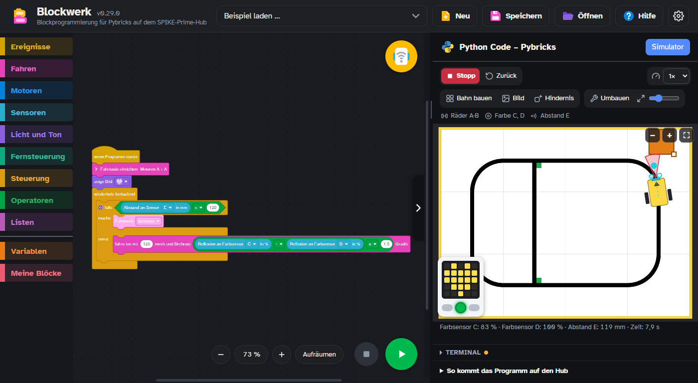
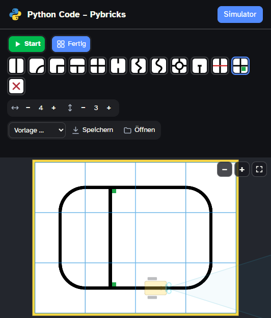
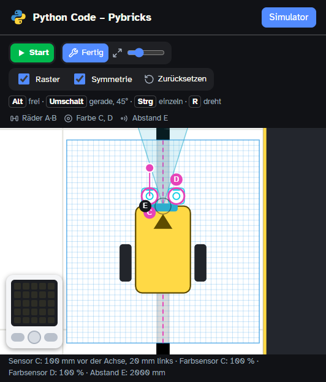
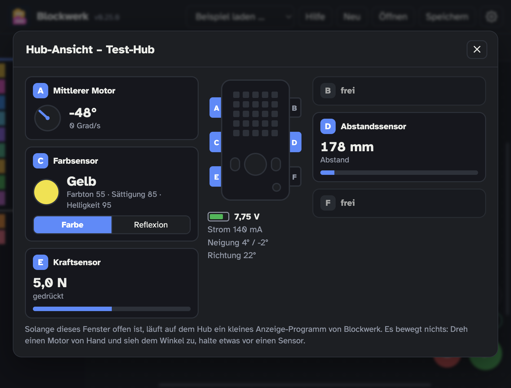
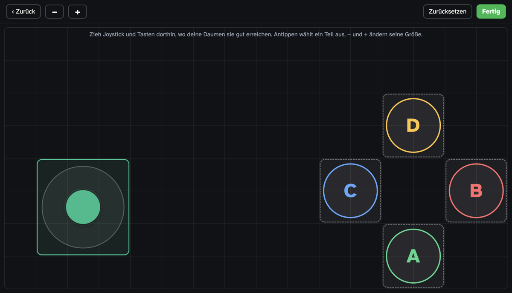
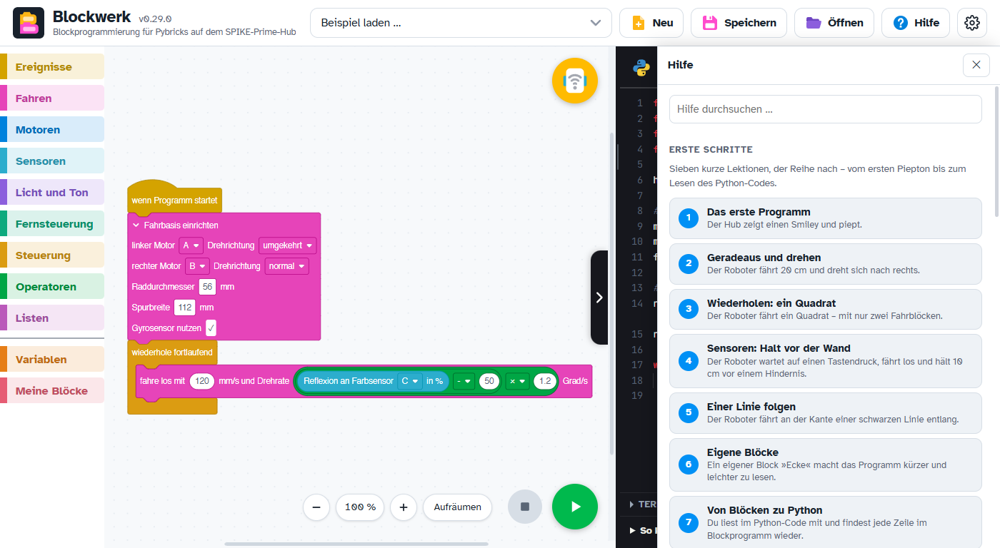
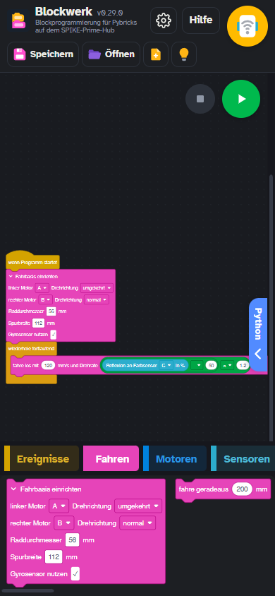
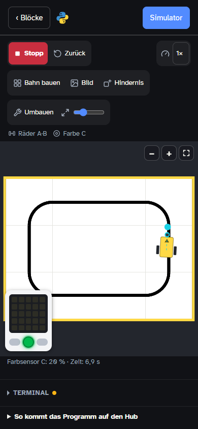

<p align="center">
  
</p>

<h1 align="center">Blockwerk</h1>

<p align="center">
  <b>Blöcke stecken, Python lesen.</b><br>
  Ein Blockeditor im Stil der LEGO-SPIKE-App, der live Python-Code für
  <a href="https://pybricks.com">Pybricks</a> erzeugt.
</p>

<p align="center">
  <a href="https://github.com/TheBaronBlood/blockwerk/releases/latest"></a>
  <a href="https://github.com/TheBaronBlood/blockwerk/actions/workflows/programm.yml"></a>
  
</p>

<p align="center">
  <a href="#herunterladen">Herunterladen</a> ·
  <a href="#erste-schritte">Erste Schritte</a> ·
  <a href="#was-blockwerk-kann">Funktionen</a> ·
  <a href="#programme-ohne-roboter-ausprobieren">Simulator</a> ·
  <a href="ROADMAP.md">Roadmap</a> ·
  <a href="CHANGELOG.md">Versionen</a>
</p>

<p align="center">
  <picture>
    <source media="(prefers-color-scheme: dark)" srcset="docs/bilder/editor-dunkel.png">
    
  </picture>
</p>

Blockwerk ist für eine Robotik-AG mit LEGO SPIKE Prime entstanden. Die Schülerinnen und
Schüler bauen ihr Programm aus Blöcken und sehen daneben, wie dasselbe Programm in Python
aussieht. So wird der Umstieg von Blöcken auf Python ein Schritt, den man mitlesen kann.

> [!NOTE]
> Blockwerk ist in Entwicklung (Version 0.x). Vieles ist bisher nur im Emulator und mit
> nachgestellten Hubs geprüft, noch nicht an echten Hubs und Tablets. Was erprobt ist und
> was nicht, steht bei jedem Meilenstein in der [Roadmap](ROADMAP.md).

## Was Blockwerk kann

### Blöcke stecken, Python lesen

- **Blöcke → Python:** Fahren, Motoren, Sensoren, Licht und Ton, Steuerung, Operatoren,
  Listen, Variablen, eigene Blöcke. Ein Klick auf eine Codezeile markiert den Block dazu –
  und wer einen Block wählt, sieht seine Zeilen im Code.
- **Mehreres gleichzeitig:** Mehrere Ereignisse laufen nebeneinander, wie in der
  SPIKE-App – »wenn Programm startet«, »wenn …« mit jeder Bedingung und Nachrichten
  zwischen den Programmteilen. Mit nur einem Ereignis bleibt das Python so einfach wie
  zuvor.
- **Mehrere Blöcke auf einmal:** mit gedrückter Umschalttaste anklicken oder einen Rahmen
  aufziehen, dann kopieren, duplizieren oder löschen. Was zusammenhing, bleibt beim Einfügen
  zusammen.
- **SPIKE-Projekte öffnen:** `.llsp3`-Dateien (Wortblöcke) aus der SPIKE-App werden in
  Blockwerk-Blöcke übersetzt; ein Bericht zeigt, was umgerechnet wurde.
- **Erweiterungen:** eigene Blöcke mit eigenem Python-Code bauen (zum Beispiel einen
  PID-Regler), mit Vorschau, und als Datei weitergeben. Anleitung:
  [docs/ERWEITERUNGEN.md](docs/ERWEITERUNGEN.md).

| Mehrere Blöcke auf einmal |
|:---:|
|  |
| Mit Umschalt gewählt: Die Leiste oben dupliziert oder löscht die ganze Auswahl. |

### Ohne Roboter ausprobieren

Der **Simulator** lässt das Programm auf einer Bahn im Fenster laufen. Der Roboter entsteht aus
dem Programm – Räder, bis zu vier Farbsensoren, Abstandssensor, Kraftsensor – und fährt über
eine Bahn mit schwarzer Linie. Die Bahn baut man selbst **aus Platten wie bei RoboCup Junior
Rescue Line**: Gerade, Kurve, Abzweig, Kreuzung, Lücke und mehr, mit grünen Punkten an den
Kreuzungen. Hindernisse lassen sich frei setzen, der Hub zeigt Lichtmatrix und Tasten. Beim
»Umbauen« lassen sich die Sensoren versetzen und drehen, mit Raster und Symmetrie. Mehr dazu
unter [Programme ohne Roboter ausprobieren](#programme-ohne-roboter-ausprobieren).

| Simulator |
|:---:|
|  |
| Der Linienfolger hält vor dem Hindernis; der Hub zeigt das Herz aus dem Programm. |

| Bahn bauen | Umbauen |
|:---:|:---:|
|  |  |
| Platten legen und drehen, grüne Punkte in die Ecken der Kreuzungen. | Sensoren versetzen und drehen. |

### Mit dem Hub

- **Direkt auf den Hub laden:** per Bluetooth, mit Terminal für die Ausgaben des Hubs. Bei
  einem Fehler wird der auslösende Block markiert. Mit der Beta-Firmware 4.1 von Pybricks
  geht es auch über das USB-Kabel.
- **Erkennt, was am Hub steckt:** Nach dem Verbinden zeigen die Blöcke in der Blockliste
  schon die richtigen Anschlüsse – der Kraftsensor »F«, wenn er an F steckt.
- **Hub-Ansicht:** zeigt den Hub von oben und für jeden Anschluss, was dort steckt und was
  es gerade misst – bei Motoren den Winkel mit einem Zeiger, der sich mitdreht, beim
  Farbsensor Farbe oder Reflexion, dazu Abstand und Kraft; außerdem Akku, Ladezustand und
  Neigung. Sie läuft, solange kein eigenes Programm läuft: Blockwerk lädt dafür ein kleines
  Anzeige-Programm auf den Hub, das nichts bewegt, und legt beim Schließen wieder dein
  zuletzt geladenes Programm darauf.
- **Fernsteuerung:** Steuerfeld mit Joystick und Tasten – auf dem Tablet als Controller
  über den ganzen Bildschirm, frei anzuordnen –, dazu Xbox-Controller und
  LEGO-Fernbedienung.

| Hub-Ansicht | Steuerfeld als Controller |
|:---:|:---:|
|  |  |
| Was an den Anschlüssen hängt und was es gerade misst – hier mit dem Test-Hub. | Joystick und Tasten liegen in einem Raster und lassen sich verschieben. |

### Lernen

- **Eingebaute Hilfe:** »Erste Schritte« in sieben Lektionen, eine Seite zu jedem Block mit
  Python-Beispiel, Erklärungen zu den Python-Wörtern im Code und kurze Kapitel zum Umstieg
  auf Python.
- **Kurs der Robotik-AG:** die Module 0 bis 8 mit Aufgaben, Hilfekarten zum Aufdecken,
  Bug-Jagd-Programmen und einem Quiz je Modul. Stolpersteine und Lösungen sieht nur, wer in
  den Einstellungen »Kursleitung« einschaltet.

| Eingebaute Hilfe |
|:---:|
|  |
| Lektionen, Blockseiten und Python-Kapitel, ohne Internet. |

### Auf Computer, Tablet und Handy

- **Als Programm** für Windows, macOS und Linux – läuft ohne Internet und ohne Browser.
- **Als App für Android**, auf Tablets und Handys, mit Bluetooth und USB-Kabel.
- **Im Browser** (Chrome oder Edge), wenn jemand Blockwerk
  [ins Netz stellt](docs/ENTWICKLUNG.md#im-netz-bereitstellen-cloudflare); am iPad geht das im
  Browser »Bluefy«.
- **Eine eigene Ansicht fürs Handy:** Hochkant liegen die Kategorien als Leiste am unteren
  Rand; Python-Code, Hilfe und Simulator füllen den Bildschirm.

| Auf dem Handy | Simulator auf dem Handy |
|:---:|:---:|
|  |  |
| Ein Tipp auf eine Kategorie klappt ihre Blöcke auf. | Der Linienfolger auf dem Rundkurs. |

Welche Fassung was kann und was davon an echten Geräten erprobt ist, steht unter
[Tablets](#tablets).

## Herunterladen

Die fertigen Programme hängen an jedem
[Release](https://github.com/TheBaronBlood/blockwerk/releases/latest). Sie laufen ohne
Internet und ohne Browser.

| System | Datei | Für wen |
|--------|-------|---------|
| Windows | `…-Setup.exe` | Installation ohne Administratorrechte – der empfohlene Weg |
| Windows | `.zip` | ohne Installation: entpacken (auch auf einen USB-Stick) und `Blockwerk.exe` starten |
| Windows | `…-portable.exe` | eine einzelne Datei; packt sich bei **jedem** Start aus und braucht rund zehn Sekunden |
| macOS | `…-mac-arm64.dmg` | Macs mit Apple-Chip (alle seit Ende 2020) |
| macOS | `…-mac-x64.dmg` | ältere Macs mit Intel-Prozessor |
| Linux | `.deb` | Ubuntu und Verwandte – der zuverlässigste Weg |
| Linux | `.AppImage` | ohne Installation |
| Android | `…-android.apk` | Tablets und Handys |
| iPad | – | keine App; im Browser »Bluefy« geht die Fassung im Netz, siehe [Tablets](#tablets) |

<details>
<summary><b>Hinweise zum ersten Start je System</b></summary>

- **Windows:** Der Installer fragt nach dem Ordner und legt einen Eintrag zum
  Deinstallieren an (Windows-Einstellungen → Apps, oder `Uninstall Blockwerk.exe` im
  Programmordner). Danach startet Blockwerk in etwa einer Sekunde. Windows warnt beim
  ersten Start vor einem unbekannten Herausgeber: »Weitere Informationen« → »Trotzdem
  ausführen«.
- **macOS:** Das Programm ist nicht von Apple beglaubigt. Beim ersten Start meldet macOS,
  der Entwickler sei nicht überprüft. Dann Systemeinstellungen → »Datenschutz &
  Sicherheit« → »Dennoch öffnen« (bei älterem macOS: Rechtsklick → »Öffnen«). Auf einem
  Mac mit Apple-Chip läuft die Intel-Fassung zwar, aber spürbar zäh.
- **Linux:** Das `.deb` braucht Administratorrechte: `sudo apt install ./Blockwerk-….deb`.
  Das AppImage ausführbar machen (`chmod +x`) und starten; Ubuntu ab 22.04 braucht dafür
  einmalig das Paket `libfuse2`. Fehlt es und darf man nichts installieren, startet
  `./Blockwerk-….AppImage --appimage-extract-and-run` trotzdem.
- **Linux ohne Installationsrechte (Schul-PC, USB-Stick):** Das AppImage braucht keine
  Installation. Von einem Stick mit FAT oder exFAT lässt es sich aber nicht direkt starten,
  weil diese Dateisysteme kein »ausführbar« kennen: die Datei erst in den persönlichen
  Ordner kopieren, dort ausführbar machen und starten. Liegt neben der AppImage-Datei ein
  Ordner `Blockwerk-Daten`, legt Blockwerk seine Daten dort ab statt im Benutzerprofil.
  Für den Hub am **Kabel** braucht jeder PC einmalig die Freigabe durch einen Administrator
  (das `.deb` oder die Datei `build/70-blockwerk-hub.rules`, siehe [Hub am USB-Kabel](#hub-am-usb-kabel)) – außer die
  Benutzer gehören zur Gruppe `dialout`. Bluetooth geht ohne.
- **Android:** Die APK auf dem Gerät öffnen und die Installation erlauben. Ob sich eine
  neue Fassung über die vorhandene installieren lässt, hängt vom Schlüssel ab, mit dem die
  APK signiert ist: Ohne festen Schlüssel ist jede Fassung anders signiert, und die alte App
  muss vorher deinstalliert werden (die gespeicherten Programme gehen dabei verloren –
  vorher speichern). Mit festem Schlüssel entfällt das, siehe
  [Android-Schlüssel](docs/ENTWICKLUNG.md#android-schlüssel).
- **Bluetooth:** Der Rechner braucht einen Bluetooth-Adapter (ab Version 4.0). Viele
  Standrechner haben keinen eingebaut – dann hilft ein USB-Bluetooth-Stecker.

</details>

## Erste Schritte

1. **Pybricks auf den Hub spielen** – einmalig, über [Pybricks Code](https://code.pybricks.com).
   Blockwerk selbst installiert keine Firmware.
2. **Blockwerk starten** und über »Beispiel laden …« zum Beispiel »Quadrat fahren« wählen.
3. **»Hub verbinden«** – den gelben Knopf oben rechts an der Arbeitsfläche – anklicken,
   Bluetooth wählen und den Hub aus der Liste nehmen. Der Hub muss eingeschaltet sein; seine
   Bluetooth-Taste blinkt blau. Ist ein Hub verbunden, sind die Wellen im Knopf grün; ein
   weiterer Klick öffnet die Hub-Ansicht, in der sich der Hub auch wieder trennen lässt.
4. **Der grüne Startknopf** unten rechts lädt das Programm auf den Hub und startet es, der
   rote daneben stoppt es. Was der Hub ausgibt, steht im Terminal.

Wie es danach weitergeht, zeigt die eingebaute Hilfe unter »Erste Schritte«.

Kein Hub zur Hand? Der Knopf »Simulator« über dem Python-Code lässt das Programm auf einer
Bahn im Fenster laufen.

## Gut zu wissen

### Programme ohne Roboter ausprobieren

»Simulator« über dem Python-Code zeigt statt des Codes eine Bahn von oben. »Start« dort – oder
die mittlere Taste des gezeichneten Hubs – lässt das Programm laufen; der Block, der gerade
dran ist, ist markiert, Ausgaben stehen im Terminal.

- **Der Roboter kommt aus dem Programm.** Fahrblöcke geben ihm Räder, jeder Farbsensor, den das
  Programm abfragt, sitzt vorn (höchstens vier), dazu Abstandssensor und Kraftsensor. Wer ohne
  »Fahrbasis einrichten« zwei einzelne Motoren dreht, fährt mit diesen – der linke ist dabei
  gespiegelt eingebaut wie am üblichen Roboter.
- **Die Bahn** besteht aus Platten von 30 cm, wie bei RoboCup Junior Rescue Line; am Anfang liegt
  ein Rundkurs. »Bahn bauen« zeigt die Platten zur Auswahl – Gerade, Kurve, Ecke, Abzweig,
  Kreuzung, Lücke, Zickzack, Schlangenlinie, Kreisel, Linienende und die rote Ziellinie: Ein Tipp
  auf ein Feld legt die gewählte Platte, noch ein Tipp dreht sie. Mit dem **grünen Punkt** tippt
  man an einem Abzweig, einer Kreuzung oder einem Kreisel neben die Linie, wo er hin soll – der
  Farbsensor sieht dort Grün und an der Ziellinie Rot. Die Bahn darf zwei bis acht Platten breit und zwei bis sechs hoch
  sein; es gibt Vorlagen, und sie lässt sich als Datei speichern und weitergeben. Sie bleibt
  gemerkt, samt Hindernissen und dem Platz des Roboters.
- **Ein eigenes Bild** geht auch: »Bild« nimmt ein Foto oder eine Zeichnung von oben. Der Regler
  neben »Umbauen« stellt ein, wie groß der Roboter darauf ist.
- **Roboter und Hindernisse** lassen sich ziehen, der Roboter am Punkt vor ihm drehen, ein
  Hindernis an seiner Ecke größer und kleiner ziehen; ein Doppelklick räumt es weg.
- **Der Rand** um die Bahn hält den Roboter auf: Er fährt dagegen und steht an. Ein Klick auf den
  Rand schaltet weiter – **Gelb:** kein Sensor bemerkt ihn; **Orange:** eine niedrige Wand, die nur
  der Kraftsensor spürt; **Rot:** eine hohe Wand, die auch der Abstandssensor sieht; **gestrichelt:**
  kein Rand, der Roboter fährt von der Bahn herunter.
- **Heranholen:** Mausrad oder zwei Finger holen die Bahn heran, an freier Stelle lässt sie sich
  verschieben; die Knöpfe oben rechts tun dasselbe. Fährt der Roboter dabei aus dem Bild, wandert
  die Bahn mit.
- **Der Hub** liegt in der Ecke über der Bahn und zeigt die Lichtmatrix; seine Tasten lassen sich
  drücken. Die mittlere leuchtet grün, solange das Programm läuft – oder in der Farbe, die der
  Block »Statuslicht« einstellt. Ein Doppelklick auf den Hub zeigt nur noch ihn.
- **Umbauen** zeigt den Roboter groß. Sensoren lassen sich versetzen und am Knopf drehen: auf
  einem Raster im Abstand der LEGO-Noppen (8 mm), in Schritten von 15 Grad, auf Wunsch
  spiegelbildlich. Mit Tastatur: <kbd>Alt</kbd> ohne Einrasten, <kbd>Umschalt</kbd> nur eine
  Richtung (beim Drehen 45 Grad), <kbd>Strg</kbd> ohne Spiegeln, <kbd>R</kbd> dreht, die
  Pfeiltasten versetzen.

Der Simulator führt die Blöcke aus, nicht den Python-Code. Blöcke aus Erweiterungen, den
Xbox-Controller und die LEGO-Fernbedienung überspringt er (das Steuerfeld von Blockwerk geht).
Er taugt, um die Logik eines Programms zu prüfen – Kreuzungen, Lücken, Halt vor der Wand –, nicht
zum Feinabstimmen eines Reglers: Der Roboter fährt ohne Anlauf und ohne Messfehler. Die Bahn ist
flach – Rampe, Wippe und der Raum mit den Opfern fehlen. Was sonst noch fehlt, steht in der
[Roadmap](ROADMAP.md) unter Meilenstein 10.

### Hub am USB-Kabel

»Hub verbinden« bietet neben Bluetooth auch das USB-Kabel an. Das funktioniert nur, wenn
auf dem Hub eine Pybricks-Firmware läuft, die USB kann: derzeit die **Beta 4.1**
(Installation über [beta.pybricks.com](https://beta.pybricks.com)). Die stabile Firmware
4.0 hat USB abgeschaltet; dort bleibt nur Bluetooth.

Unter Linux ist die Schnittstelle des Hubs ohne Freigabe gesperrt. Das `.deb`-Paket
richtet die Freigabe selbst ein. Beim AppImage oder im Browser einmalig von Hand:

```
sudo cp build/70-blockwerk-hub.rules /etc/udev/rules.d/
sudo udevadm control --reload
```

Danach den Hub neu einstecken. Windows und macOS brauchen nichts weiter.

### Tablets

Die eingebauten Browser der Tablets können weder Web Bluetooth noch Web Serial; in der App
gehen Bluetooth und Kabel deshalb über die Wege des Geräts selbst.

Die App gibt es für **Android** (Tablets und Handys):

| | Android |
|---|---|
| Bluetooth | ja |
| USB-Kabel | ja (USB-C direkt, sonst OTG-Adapter; Pybricks-Beta 4.1) |
| Speichern | Dateiauswahl des Systems (»Speichern unter«) |
| Woher | APK am Release |

**Stand:** Die Android-App ist im Emulator durchgespielt (Start, Plugins, Suche nach Hubs,
Meldung ohne Hub am Kabel, Speichern, Steuerfeld mit Berührungen, Kurs, Python-Übersetzer).
Bluetooth lief mit der App auf einem echten Handy; das Kabel ist an einem echten Gerät noch
nicht erprobt.

**iPad:** Eine App gibt es nicht, aber einen Weg über den Browser: Wer Blockwerk im Netz
bereitstellt ([Anleitung](docs/ENTWICKLUNG.md#im-netz-bereitstellen-cloudflare)), kann es am iPad im Browser
»Bluefy« aus dem App Store öffnen. Der bringt Bluetooth mit; Safari und Chrome können das am
iPad nicht. Erprobt sind dort das Verbinden mit dem Hub und ein Programm mit dem Steuerfeld
(ab 0.26.1).

Die eigene iPad-App ist zurückgestellt. Das Projekt liegt im Ordner `ios/` bei und läuft im Simulator, ist aber an keinem Hub
erprobt und wird derzeit nicht gepflegt. Ein Kabel ginge dort ohnehin nicht – iPadOS lässt
Apps nicht an beliebige USB-Geräte –, und die Verteilung an mehrere iPads braucht das Apple
Developer Program.

### Wo Blockwerk seine Daten ablegt

Das Programm auf der Arbeitsfläche, die Erweiterungen und die Einstellungen liegen in einem
Datenordner. Welcher das ist, bestimmst du:

- **Standard:** der übliche Ordner des Betriebssystems (unter Windows
  `%APPDATA%\Blockwerk`). Die Deinstallation räumt ihn mit auf.
- **Selbst gewählt:** Zahnrad → **Speicherort** → »Ordner ändern …«. Blockwerk legt dort
  einen Unterordner `Blockwerk-Daten` an und zieht beim Neustart mit allen Daten um.
- **Beim Programm (USB-Stick):** Liegt neben `Blockwerk.exe` ein Ordner `Blockwerk-Daten`,
  benutzt Blockwerk immer diesen – auf jedem Rechner, an dem der Stick steckt. Auf dem
  Rechner selbst bleibt dann nichts zurück.

Projekte, die du mit »Speichern« sicherst, landen dort, wo du sie hinlegst.

### Was Blockwerk speichert und was ins Internet geht

Blockwerk hat keinen Server, keine Konten und keine Auswertung der Nutzung. Programme,
Erweiterungen, Einstellungen und Quiz-Ergebnisse bleiben auf dem Gerät (im Browser im
Speicher der Seite, im Programm im Datenordner). Ins Internet geht genau eine Anfrage, und
nur auf Knopfdruck: »Über Blockwerk« → »Nach neuer Pybricks-Firmware suchen« fragt die Liste
der Pybricks-Fassungen bei GitHub ab. Schriften, Symbole und der Python-Übersetzer liegen
Blockwerk bei.

## Selbst bauen

Es braucht [Node.js](https://nodejs.org) ab Version 20 – und Python 3, aber nur für die Tests,
die den erzeugten Code prüfen.

```
npm install
npm run dev
```

Danach `http://localhost:5173` öffnen; soll es auf den Hub gehen, in Chrome oder Edge. In
VS Code genügt **F5**.

| Befehl | Wirkung |
|--------|---------|
| `npm run dev` | Entwicklungsserver; Änderungen erscheinen sofort |
| `npm run build` | Typprüfung und fertige Version in `dist/` |
| `npm test` | alle Tests |
| `npm run app` | Programm aus dem aktuellen Stand starten |
| `npm run dist` | Programm für das eigene Betriebssystem packen |

Alles Weitere steht in [docs/ENTWICKLUNG.md](docs/ENTWICKLUNG.md): Blockwerk im Netz
bereitstellen (Cloudflare), Programme und Releases bauen, die App für Tablets samt
Android-Schlüssel und der Aufbau des Quelltexts.

## Mehr lesen

- [ROADMAP.md](ROADMAP.md) – Meilensteine, was fertig ist und was noch nicht an echter
  Hardware erprobt wurde
- [CHANGELOG.md](CHANGELOG.md) – was sich von Version zu Version geändert hat
- [docs/ERWEITERUNGEN.md](docs/ERWEITERUNGEN.md) – eigene Blöcke bauen
- [docs/ENTWICKLUNG.md](docs/ENTWICKLUNG.md) – Blockwerk selbst bauen, ins Netz stellen, als Programm und
  App packen; der Aufbau des Quelltexts

Fehler gefunden oder eine Idee? Unter
[Issues](https://github.com/TheBaronBlood/blockwerk/issues) ist der richtige Ort dafür.

## Dank

Blockwerk gäbe es nicht ohne [Pybricks](https://pybricks.com). Die Firmware auf dem Hub, die
Befehle für Motoren und Sensoren und der Python-Übersetzer stammen vom Team von Pybricks – frei
verfügbar für alle und ständig weiterentwickelt. Vielen Dank dafür!

Blockwerk ersetzt Pybricks nicht, es baut darauf auf. Wer Blockwerk nützlich findet, kann die
Arbeit an Pybricks [unterstützen](https://github.com/sponsors/pybricks).

## Lizenz

Blockwerk steht unter der [MIT-Lizenz](LICENSE): Jeder darf es benutzen, verändern und
weitergeben – auch als Teil eigener Projekte. Der Lizenztext mit dem Urhebervermerk muss
dabei bleiben; eine Gewähr gibt es nicht.

## Lizenzen der verwendeten Software

Blockly: Apache-2.0. Pybricks (Firmware, mpy-cross, Protokoll), fflate, Capacitor und
Electron: MIT. Die Schriften Atkinson Hyperlegible und JetBrains Mono: SIL Open Font
License 1.1.

Die Klänge in `public/klang/` stehen nicht unter MIT:

- `snap.wav`, `snap.mp3`, `wosh.wav` (Zusammenstecken, Löschen): von
  [Pixabay](https://pixabay.com/service/license-summary/), unter der dortigen Inhaltslizenz –
  als Teil von Blockwerk frei benutzbar, aber nicht für sich allein weiterzuverkaufen.
- `bong.wav`, `conected.wav`, `disconected.wav` (Kategorien, Hub verbunden und getrennt): aus
  [»Interface Sounds« von Kenney](https://kenney.nl/assets/interface-sounds), gemeinfrei (CC0).
- `cursor.wav` (Knöpfe): »Cursor 1« aus dem
  [»Ultimate UI SFX Pack« von JDSherbert](https://jdsherbert.itch.io/ultimate-ui-sfx-pack),
  © 2023 JDSherbert, unter der Lizenz, die dem Paket beiliegt (Namensnennung nötig).

Die vollständigen Lizenztexte stellt der Build aus den Paketen zusammen, die wirklich im
fertigen Blockwerk stecken (`build/lizenzen.mjs`), und legt sie als `lizenzen.txt` neben die
Seite. In Blockwerk stehen sie unter »Über Blockwerk« → »Lizenzen anzeigen«.

LEGO und SPIKE sind Marken der LEGO Gruppe; dieses Projekt ist kein Produkt von LEGO oder
Pybricks und wird von beiden weder unterstützt noch geprüft.
